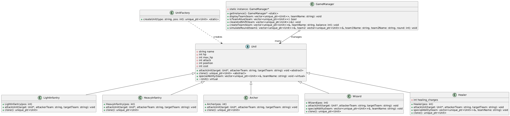

# Игра: Lgame

## Описание игры
"Lgame" — это консольная пошаговая игра, в которой две команды сражаются друг с другом до тех пор, пока у одной из команд не останется живых юнитов. Игроки создают свои команды, выбирая юнитов из доступных типов в пределах начального баланса (100 единиц). После формирования команд игра автоматически симулирует сражение, отображая действия каждого юнита и состояние команд после каждого раунда. Побеждает команда, у которой остаются живые юниты.

### Основные механики
1. **Создание команд**: Игроки вводят названия команд и выбирают юнитов (например, "LI" для легкой пехоты) до исчерпания баланса или ввода "done".
2. **Сражение**: Каждый раунд состоит из действий юнитов обеих команд (атаки или специальные способности). Юниты с HP ≤ 0 удаляются, а позиции оставшихся сдвигаются.
3. **Вывод**: После каждого раунда отображается состояние команд, разделенное линией (`------------------`) для удобства чтения.
4. **Окончание**: Игра завершается, когда одна из команд теряет всех юнитов, и объявляется победитель.

---

## Использованные паттерны проектирования

1. **Одиночка (Singleton)**
    - **Класс**: `GameManager`.
    - **Описание**: Гарантирует, что существует только один экземпляр менеджера игры для управления состоянием и логикой.
    - **Реализация**: Приватный статический указатель `instance` и метод `getInstance()` создают или возвращают единственный экземпляр.

2. **Фабричный метод (Factory Method)**
    - **Класс**: `UnitFactory`.
    - **Описание**: Инкапсулирует создание объектов юнитов, позволяя создавать разные типы без явного указания их классов.
    - **Реализация**: Статический метод `createUnit` принимает строку (тип юнита) и возвращает `unique_ptr<Unit>`.

3. **Прототип (Prototype)**
    - **Класс**: `Unit` и его наследники.
    - **Описание**: Позволяет юнитам создавать свои копии (используется для клонирования в `Wizard`).
    - **Реализация**: Чисто виртуальный метод `clone()` возвращает копию юнита через `make_unique`.

---

## Классы и их описание

### Базовый класс: `Unit`
- **Назначение**: Абстрактный базовый класс для всех типов юнитов, определяющий общие атрибуты и поведение.
- **Атрибуты**:
    - `string name`: Название юнита (например, "Легкая пехота").
    - `int hp`: Текущие очки здоровья.
    - `int max_hp`: Максимальные очки здоровья.
    - `int attack`: Урон за атаку.
    - `int position`: Позиция в команде (начинается с 1).
    - `int cost`: Стоимость в игровых единицах для создания команды.
- **Методы**:
    - `virtual void attackUnit(Unit* target, const string& attackerTeam, const string& targetTeam) = 0`: Чисто виртуальный метод для атаки цели с выводом действия в консоль.
    - `virtual unique_ptr<Unit> clone() const = 0`: Чисто виртуальный метод для клонирования юнита.
    - `virtual void specialAbility(vector<unique_ptr<Unit>>& team, const string& teamName) {}`: Виртуальный метод для специальных способностей (по умолчанию пустой).
    - `virtual ~Unit() = default`: Виртуальный деструктор для корректного удаления наследников.

### Наследуемые классы

1. **Легкая пехота (LightInfantry)**
    - **Конструктор**: Устанавливает `name = "Light Infantry"`, `hp = max_hp = 50`, `attack = 8`, `cost = 10`, `position = pos`.
    - **attackUnit**: Атакует 2-3 раза (случайно), нанося 8 урона за удар, если HP цели > 0.
    - **clone**: Возвращает новую легкую пехоту с той же позицией.

2. **Тяжелая пехота (HeavyInfantry)**
    - **Конструктор**: Устанавливает `name = "Heavy Infantry"`, `hp = max_hp = 100`, `attack = 20`, `cost = 30`, `position = pos`.
    - **attackUnit**: Атакует один раз, нанося 20 урона.
    - **clone**: Возвращает новую тяжелую пехоту.

3. **Лучник (Archer)**
    - **Конструктор**: Устанавливает `name = "Archer"`, `hp = max_hp = 40`, `attack = 7`, `cost = 20`, `position = pos`.
    - **attackUnit**: Атакует 1-5 раз (случайно), нанося 7 урона за удар.
    - **clone**: Возвращает нового лучника.

4. **Волшебник (Wizard)**
    - **Конструктор**: Устанавливает `name = "Wizard"`, `hp = max_hp = 30`, `attack = 5`, `cost = 30`, `position = pos`.
    - **attackUnit**: Атакует один раз, нанося 5 урона.
    - **specialAbility**: С 10% вероятностью клонирует первого живого `LightInfantry` или `Archer` в команде, вставляя копию на ту же позицию и переназначая все позиции.
    - **clone**: Возвращает нового волшебника.

5. **Целитель (Healer)**
    - **Конструктор**: Устанавливает `name = "Healer"`, `hp = max_hp = 50`, `attack = 8`, `cost = 15`, `position = pos`, `healing_charges = 5`.
    - **attackUnit**: Ничего не делает (целитель не атакует).
    - **specialAbility**: Если есть заряды (`healing_charges > 0`), лечит первого юнита с HP < 30 (кроме волшебников) на 5 HP, уменьшая количество зарядов.
    - **clone**: Возвращает нового целителя.

### Служебные классы

1. **UnitFactory**
    - **Метод**: `static unique_ptr<Unit> createUnit(const string& type, int pos)` создает юнита по типу (например, "LI", "HI").
    - **Интерфейс**: Простой фабричный метод, возвращающий `unique_ptr<Unit>` или `nullptr` при неверном типе.

2. **GameManager**
    - **Атрибуты**: `static GameManager* instance` (Singleton).
    - **Методы**:
        - `static GameManager* getInstance()`: Возвращает единственный экземпляр менеджера.
        - `void displayTeam(const vector<unique_ptr<Unit>>& team, const string& teamName)`: Выводит состав команды или "Нет оставшихся юнитов".
        - `bool isTeamAlive(const vector<unique_ptr<Unit>>& team)`: Проверяет, есть ли живые юниты в команде.
        - `void cleanAndShift(vector<unique_ptr<Unit>>& team)`: Удаляет юнитов с HP ≤ 0 и переназначает позиции с 1.
        - `void createTeam(vector<unique_ptr<Unit>>& team, const string& teamName, int balance)`: Создает команду, запрашивая типы юнитов у пользователя, пока баланс не исчерпан или не введено "done".
        - `void simulateRound(vector<unique_ptr<Unit>>& team1, vector<unique_ptr<Unit>>& team2, const string& team1Name, const string& team2Name, int round)`: Симулирует раунд, включая атаки и специальные способности юнитов обеих команд.

---

## Функции игрового процесса

### Примечание
Функции `createTeam` и `simulateRound` были перемещены в класс `GameManager` в рамках рефакторинга для улучшения инкапсуляции и централизации управления игрой. Их описание теперь включено в раздел `GameManager` выше.

### main
- Инициализирует игру, обрабатывает ввод пользователя и управляет процессом (создание команд, сражение, объявление победителя).
- Использует `system("clear")` для очистки консоли в ключевых местах.
- Вызывает методы `GameManager`:
    - `gm->createTeam` для создания команд.
    - `gm->simulateRound` для симуляции каждого раунда.
    - `gm->displayTeam`, `gm->isTeamAlive`, `gm->cleanAndShift` для управления состоянием игры.

---

## Пример вывода

[](https://editor.plantuml.com/uml/tLHDRzGm4BtdLrWze6sxMwaSerNKlG2LW0CVubZDEkxk2CSEzcH5-E2tCyueMeUYHXKW43VFpFERvvV9N4M2G5rZ2zX62g19QGinghSEINqkb5fn6jrEEMXC2j6HshVZgO6FDyS8Y42_7wFMHoJqReorZyJdSq6b1WjklZDK3jtEbaeg9hmnq9HA6Y-LWFBSQQaE7ckrNe-ggoenQ-kTMN2rS_YXCpSjXNMYhkuWOsiqWjriqIBr2nh83qQJ3-iVBrUFbYe1Nh83TnKSaFq3AxJVXbUbecIBhqKXVZx7tPwktIqu2lrWxFaajM2tIeMEJd-hHVUwSbJtpC2XdwgJr3-XRXFqtWIH9UU_g-STVe9GYnuv_q4zlpwf3nm4ErWz_kaSCycDtYUDCR48vBzvSGgV09EFWw-30JBobhurHz7ZYt--No81eQuovgUiwGKus8s62eGf-E2qANF4MMhDdbnBaKLFota7HjOOMmjzSd36e7lzmPWODXOFPeQ6BsszjsAg0RTnzUiztjBSvycQYR4Y-Q7VTAcsOCKqT9GF2pQTPTfNldFrm7ivI_nu5d4vwIsNfgcG-kLYqdTF76hzPRMQhliids_LF2zhBKl8NfdUj8meydczkAZKW2YLc1kBVEZyQbMfamPSVpB2cbHYs9LnTTVOxm00)